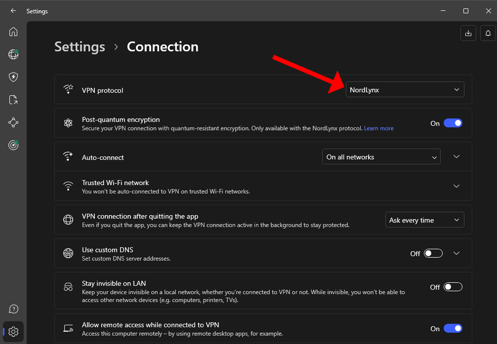
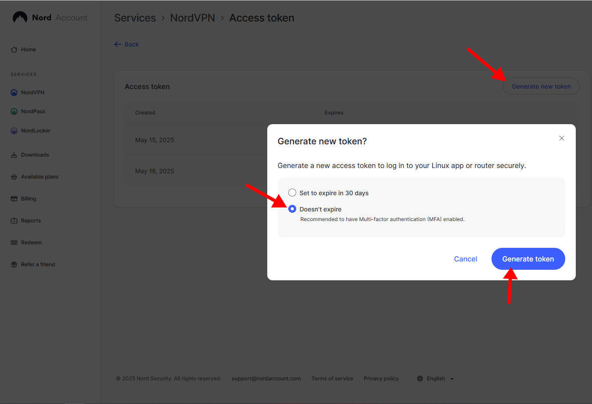

# NordLynx WireGuard Config Generator

A PowerShell script to generate a valid WireGuard configuration file from NordVPN's NordLynx protocol.
No need for manual API calls or external tools — just your access token and a few steps.

---

## 🔧 What This Script Does

* Authenticates with NordVPN using your **Linux access token**
* Retrieves a fresh WireGuard config (private key, public key, endpoint, etc.)
* Saves it with a custom filename ready for use in any WireGuard client

---

## ⚙️ Requirements

* Windows with PowerShell 5.1+ or PowerShell Core on Linux/macOS
* A valid **NordVPN account**
* Access token generated via the Nord Account dashboard

---

## 🚀 Usage

```powershell
.\Generate-WireGuardConfig.ps1
```

The script will ask you to enter your **NordVPN Linux access token** during execution.

---

## 📸 Setup Guide

### **Step 1 – Install & Configure the NordVPN Client**

1. Download and install the NordVPN client for your OS.
2. Open the client and go to **Settings > Connection**
3. Set **VPN protocol** to `NordLynx`

*Screenshot reference:*



---

### **Step 2 – Generate an Access Token**

1. Visit [https://my.nordaccount.com/dashboard/nordvpn/manual-configuration/](https://my.nordaccount.com/dashboard/nordvpn/manual-configuration/)
2. Click **Generate new token**
3. Select **Doesn’t expire**
4. Click **Generate token** and copy it somewhere safe

*Screenshot reference:*



---

### **Step 3 – Install the WireGuard Client**

Download and install from:
👉 [https://www.wireguard.com/install/](https://www.wireguard.com/install/)

---

### **Step 4 – Connect to a NordVPN Server**

Open the NordVPN app and connect to any server.
The script pulls the active connection info to retrieve the correct WireGuard credentials.

---

### **Step 5 – Run the Script**

1. Open PowerShell **as Administrator**
2. Navigate to the folder containing the script:

   ```powershell
   cd path\to\script
   ```
3. Run it:

   ```powershell
   .\Generate-WireGuardConfig.ps1
   ```

This will create a WireGuard configuration file with a name of your choice in the same directory.

---

## 📜 Output Example

```ini
[Interface]
PrivateKey = <fetched-private-key>
PublicKey = <derived-public-key>
Address = 10.5.0.2/32
DNS = 1.1.1.1

[Peer]
PublicKey = <server-public-key>
Endpoint = <server-ip>:51820
AllowedIPs = 0.0.0.0/0, ::/0
PersistentKeepalive = 25
```

---

## 📅 License

This project is licensed under the MIT License — see [LICENSE](LICENSE) for details.

---

**Disclaimer:** This project is not affiliated with NordVPN or WireGuard. All trademarks and content belong to their respective owners.
